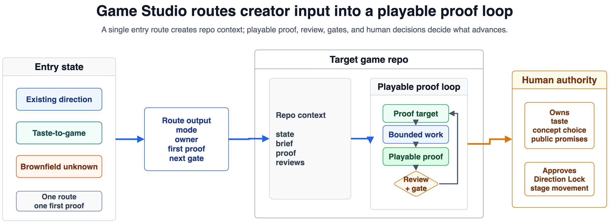

# Game Studio

A director-first operating framework for AI-assisted game development.

[](LICENSE)
[](skills/)
[](docs/substantive-review.md)
[](docs/community/publication-readiness-review.md)

Game Studio helps Codex, Claude Code, and similar agents work like a small game
team: direction first, milestones second, implementation last.

It is not a game generator. It gives a target game repository project-local
roles, gates, evidence contracts, review prompts, and agent skills.



## Why It Exists

AI agents can draft, inspect, implement, and review fast. Games still need taste,
constraints, player evidence, production judgment, and clear authority.

Game Studio keeps four questions visible:

1. What game are we making?
2. What proof is the current milestone pursuing?
3. What evidence shows the player experience is real?
4. Which role can approve, block, cut, or defer?

## What You Get

- Stage model from direction lock to release candidate.
- Gates for creative, technical, production, QA, accessibility, narrative, and release review.
- Role playbooks for director, producer, QA, systems, narrative, UX, art, and audio judgment.
- Evidence contracts for playable proof, playtests, bug triage, and public promises.
- Project-local skills for Codex and Claude Code.
- Templates for direction, milestones, handoffs, reviews, and release decisions.
- Source-backed research reports for game design, production, narrative, QA, accessibility, and craft.

## Quick Start With Codex

From the target game repository, ask Codex:

```text
Read /path/to/game-studio/adapters/codex/bootstrap.md and install
Game Studio for this game project. Select engine, scope, and genre profiles.
Keep it project-local.
```

Codex copies or adapts:

- `core/` into `.game-studio/core/`.
- `skills/` into `.codex/skills/`.
- `core/templates/` into project-facing docs when useful.
- `adapters/codex/AGENTS.md.snippet` into `AGENTS.md`.

## Quick Start With Claude Code

From the target game repository, ask Claude Code:

```text
Read /path/to/game-studio/adapters/claude/bootstrap.md and install
Game Studio for this game project. Use the selected engine, scope, and genre
profiles. Keep the framework project-local.
```

Claude Code copies or adapts:

- `core/` into `.game-studio/core/`.
- `skills/` into `.claude/skills/`.
- `core/templates/` into project-facing docs when useful.
- `adapters/claude/CLAUDE.md.snippet` into `CLAUDE.md`.

## Milestone Order

Do not start with "vertical slice" unless the core game is already proven.

1. Direction Lock
2. Protocol Proof
3. Core Loop Prototype
4. Pre-production Exit
5. Presentation Value Gate
6. Vertical Slice
7. Public Demo Candidate
8. Small Release Candidate

## Repository Map

- `docs/`: operating model, review philosophy, and documentation style.
- `core/references/`: compact craft and review references for agents.
- `core/gates/`: gate prompts and verdict rules.
- `core/roles/`: role packs, playbooks, and coordination rules.
- `core/rubrics/`: review criteria for direction, production, QA, accessibility, and craft.
- `core/templates/`: copyable project artifacts.
- `profiles/`: engine, scope, and genre profiles.
- `skills/`: project-local agent skills.
- `research/`: source-backed research and continuity handoffs.
- `examples/`: fictional sample artifacts.

## Start Here

- Read `docs/operating-model.md` for the production model.
- Read `docs/substantive-review.md` before asking an agent to judge quality.
- Read `core/references/codex-review-practice.md` for role-led review.
- Read `research/continuity/2026-05-04-substantive-review-handoff.md` to continue the current research thread.

## Community

- Use `CONTRIBUTING.md` before proposing changes.
- Use `.github/ISSUE_TEMPLATE/` to report focused problems.
- Use `SECURITY.md` for security reporting.
- Follow `CODE_OF_CONDUCT.md` in all project spaces.

## License

Game Studio is released under the MIT License. See `LICENSE` and `NOTICE.md`.
