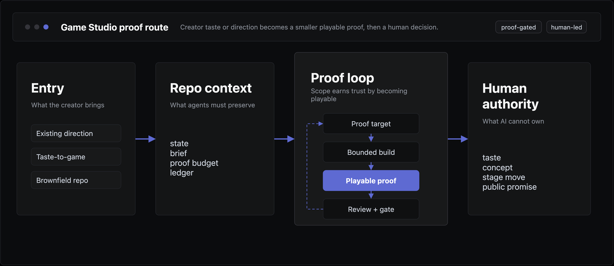

# Game Studio

Discovery-driven, proof-gated AI game production system.

[](LICENSE)
[](skills/)
[](docs/substantive-review.md)

Game Studio helps Codex and Claude Code turn either an existing game direction
or a player's taste profile into playable proofs, reviews, gates, and production
decisions. Agents can propose, plan, implement, and review; human authorship and
playable proof decide what advances.

<p align="center">
  <a href="docs/assets/readme-system-map-linear-v2.drawio.svg">
    
  </a>
</p>

## Operating Loop

```text
Taste or Direction -> Concept -> Proof -> Review -> Gate -> Next Proof
```

A concept earns more scope by becoming playable, surviving role-led review, and
passing a gate with a clear next step.

## Entry Paths

| Path | Use when | First output |
| --- | --- | --- |
| Existing direction | A mandate, pitch, prototype, task, or known game idea exists | Direction audit and next proof |
| Taste-to-game | References, emotions, scenes, constraints, or curiosity exist | Taste profile, concept slate, creative brief |
| Brownfield unknown | A repo or notes exist but authority is unclear | Adoption audit and stop condition |

See [docs/entry-model.md](docs/entry-model.md) and
[docs/beginner-taste-to-game.md](docs/beginner-taste-to-game.md).

## What You Get

| Layer | What it gives a game repo |
| --- | --- |
| Entry routing | Existing direction, taste-to-game, or brownfield route |
| Creative discovery | Taste profile, concept slate, proof budget, and brief |
| Project state | Durable `.game-studio/` context for direction, proof, review, and decisions |
| Stage model | Direction lock through release candidate |
| Claim validation | Feature, quality, and public promises mapped to proof |
| Role reviews | Verdict, severity, confidence, and next proof |
| Adapters | Codex and Claude Code project-local instructions |

Game Studio can propose concepts, plan bounded playable proofs, route reviews,
and help move a prototype toward release when gates keep passing. It does not
own the user's taste, replace playtesting, let scripts judge game quality, or
promise one-prompt finished games.

## Quick Start

From the target game repository, ask Codex or Claude Code:

```text
Read /path/to/game-studio/adapters/<codex|claude>/bootstrap.md and install
Game Studio for this game project. Preserve any existing direction first. If
no stable direction exists, route me through taste-to-game discovery. Keep it
project-local.
```

The adapter copies `core/`, installs project-local skills, and merges the
agent instruction snippet. See [adapters/](adapters/) for what each step does.

## Stage Order

Discovery routes the project before stage 1. Do not call a milestone "vertical
slice" unless the core loop is already proven.

0. Creative Discovery (taste-to-game or direction audit)
1. Direction Lock
2. Protocol Proof
3. Core Loop Prototype
4. Pre-production Exit
5. Presentation Value Gate
6. Vertical Slice
7. Public Demo Candidate
8. Small Release Candidate

## Repository Map

| Path | Purpose |
| --- | --- |
| `docs/` | Operating model, philosophy, entry model, and review guidance |
| `core/references/` | Compact craft and review references for agents |
| `core/gates/` | Gate prompts and verdict rules |
| `core/roles/` | Role packs, playbooks, and coordination rules |
| `core/rubrics/` | Review criteria for direction, production, QA, accessibility, and craft |
| `core/templates/` | Copyable project artifacts |
| `profiles/` | Engine, scope, and genre profiles |
| `skills/` | Project-local agent skills |
| `examples/` | Fictional sample artifacts |

## Start Here

| Need | Go to |
| --- | --- |
| Understand the product boundary | [docs/product-boundary.md](docs/product-boundary.md) |
| Start from taste | [docs/beginner-taste-to-game.md](docs/beginner-taste-to-game.md) |
| Run the production loop | [docs/operating-model.md](docs/operating-model.md) |
| Review a playable proof | [docs/substantive-review.md](docs/substantive-review.md) |
| Contribute | [CONTRIBUTING.md](CONTRIBUTING.md) |

## License

Game Studio is released under the MIT License. See [LICENSE](LICENSE) and
[NOTICE.md](NOTICE.md).
